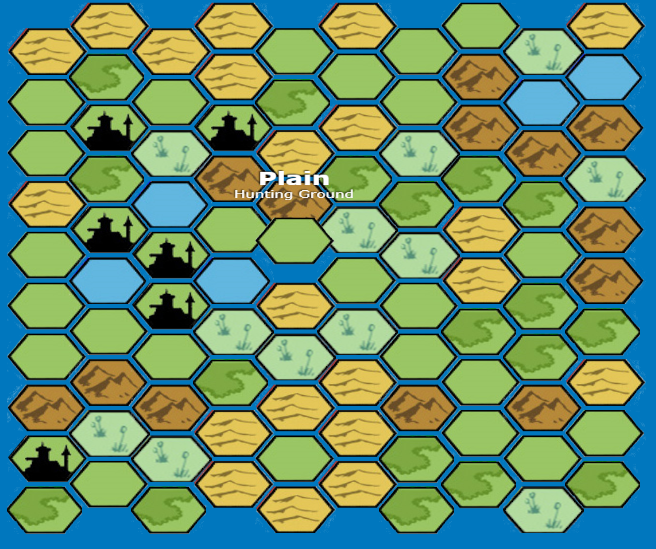

# Pathfinder 1E Random Map Generator


## Description

A random map generator for the Pathfinder Roleplay Game (1st Edition) created using the Ultimate Campaign Rules.

## Requirements

[Node](https://nodejs.org/en/) 12+

## Installation

```npm i```

## How to use

### For GMS

```npm run generate20GMMap ```

### For Players

```npm run generate20PlayerMap ```